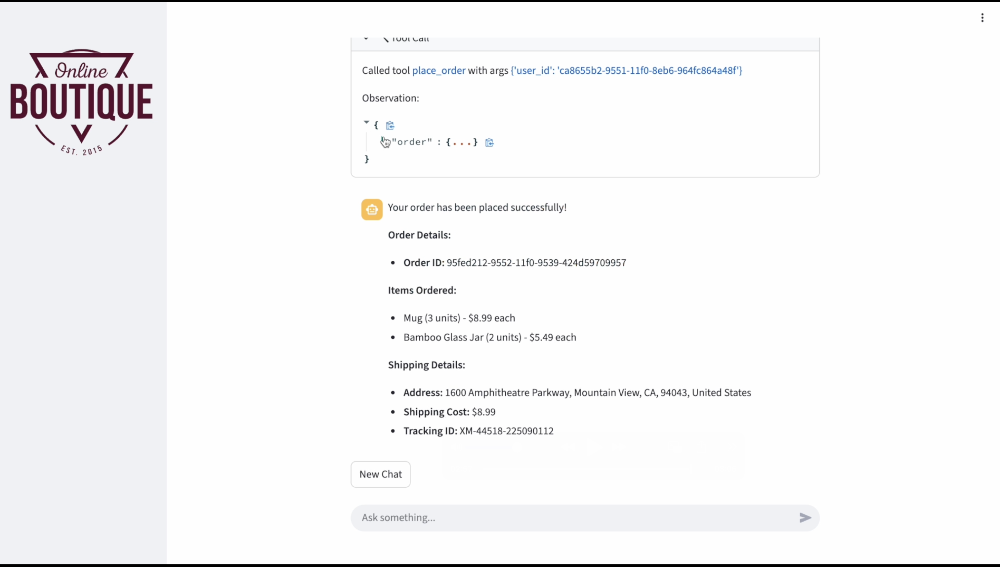
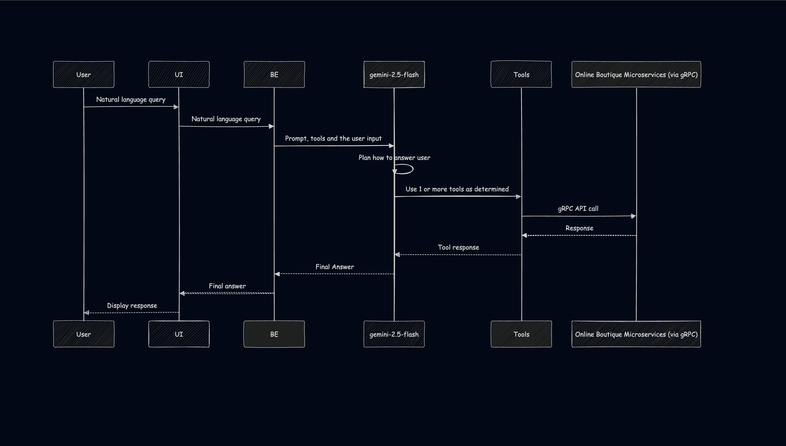

# Reactive Chat Bot

Convershop is an AI-powered shopping assistant that understands natural language. Users can ask for products in plain English — “Show me black sneakers under $80” — and the bot handles product discovery, filtering, cart management, and checkout, all through conversation.
Check the demo video [here](https://youtu.be/60D05QvQb8Q)



## Setup instructions

**Note:** As this is a customization, this demo requires you to first setup Online Boutique using this [link](https://github.com/GoogleCloudPlatform/microservices-demo/blob/main/README.md)

1. You need your Gemini API Key. You can get it [here](https://aistudio.google.com/apikey)
   Replace <YOUR_API_KEY> with your API Key and execute the following command:

```sh
echo -n '<YOUR_API_KEY>' | base64 | { read REPLACEMENT_VALUE; sed -i "s/GEMINI_API_KEY/$REPLACEMENT_VALUE/g" reactivechatbotsecrets.yaml; }
```

Or for MAC use the following command:

```sh
echo -n '<YOUR_API_KEY>' | base64 | { read REPLACEMENT_VALUE; sed -i '' "s/GEMINI_API_KEY/$REPLACEMENT_VALUE/g" reactivechatbotsecrets.yaml; }
```

2. Store the secrets in the GKE cluster by executing the following command.

```sh
kubectl apply -f reactivechatbotsecrets.yaml
```

3. Update ONLINE_BOUTIQUE_BASE_URL_VALUE in the reactivechatbotservice.yaml to the Frontend External URL you got after setting up Online Boutique without the trailing '/'

```sh
sed -i "s/ONLINE_BOUTIQUE_BASE_URL_VALUE/<FRONTEND_EXTERNAL_URL>/g" reactivechatbotservice.yaml
```

Or for MAC use the following command

```sh
sed -i '' "s/ONLINE_BOUTIQUE_BASE_URL_VALUE/<FRONTEND_EXTERNAL_URL>/g" reactivechatbotservice.yaml
```

4. Run the reactive chat bot using the following command

```sh
    kubectl apply -f reactivechatbotservice.yaml
```

5. Access the Frontend of the reactive chat bot using its frontend's external IP.

```sh
    kubectl get service reactivechatbotservice-external | awk '{print $4}'
```


